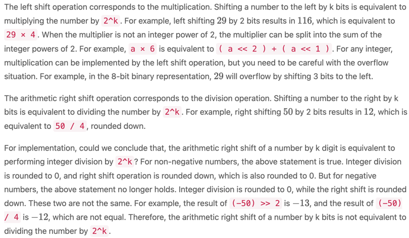
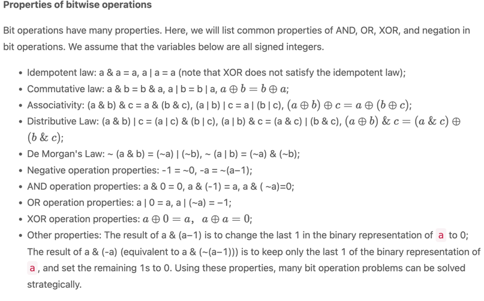

## Bit converstion and base
Base 8 to decimal 
720.5(8)
7×8^2 +2×8^1 +0×8^0 +5×8 ^−1 =464.625

## Decimal to non-decimal

To convert a decimal number to a base-X non-decimal, we need to convert the integer part and the fractional part, separately.

To convert the integer part, we will integer divide it by X until it reaches 0, and record the remainder each time. Traversing the remainder in reverse order will give us the representation in base-X system.

For example, to convert
50
50 in base-10 to base-2:

50 / 2 = 25; 50 % 2 = 0

25 / 2 = 12; 25 % 2 = 1

12 / 2 = 6; 12 % 2 = 0

6 / 2 = 3; 6 % 2 = 0

3 / 2 = 1; 3 % 2 = 1

1 / 2 = 0; 1 % 2 = 1

For example, to convert the decimal number
0.6875
0.6875 to binary:

0.6875 × 2 = 1.375 with integer 1

0.375 × 2 = 0.75 with integer 0

0.75 × 2 = 1.5 with integer 1

0.5 × 2 = 1 with integer 1

Traversing the integer apart in order, we get 1,0,1,1, so
0.6875
0.6875 in decimal will become
0.1011(2)

## Converting to other base
The common practice to convert between non-base-10 numbers is to convert to decimal first and then convert to the target base. Under certain circumstances, we can perform the conversion without going through decimal.

For instance, for converting binary numbers to octal or hexadecimal, and converting octal or hexadecimal numbers to binary, there is no need to go through the intermediate decimal step. Each digit in an octal number can be represented as three digits in a binary number. Each digit in a hexadecimal number can be represented as four digits in a binary number.

Let’s look at an example. We can group digits in a binary number
101110010(2)
in groups of three as 101|110|010, or in groups of four as 1|0111|0010, which can be converted to
562(8) in octal and 172(16) in hexadecimal.

**Complement code**

The complement code is obtained from the inverse code. The complement code of non-negative numbers is the same as the original code and the inverse code. The complement of negative numbers is obtained by adding 1 to the inverse code. Take 8-bit binary numbers as an example. The original code of
+10 is
00001010 , the inverse code is
00001010, and the complement code is
00001010; The original code of
**−ve**
−10 is

10001010, the inverse code is
11110101
11110101, and the complement code is
11110110. It is not intuitive to get the representation with the complement code directly, and it usually needs to be converted into the original code to calculate its value.

**Inverse verses complimentory code**

Introducing the inverse code solves the problem of subtraction errors, but the issue of dual representation of
0 remains. The complement code solves both the subtraction error and dual representation of
0 problem. Moreover, one more minimum value can be represented. In complement code, there is no
−0. Taking an 8-bit binary number as an example, the complement code of 0 is
00000000, while 10000000 represents
−128 does not have any representation in the original code or the inverse code (the minimum value that can be represented by the original code and the inverse code with an 8-bit binary number is
−127). Therefore, the complement code not only solves the problems of the original code and the inverse code, but can also represent one additional minimum value. Given these advantages of the complement code, the computer uses the complement code for calculations.

**Bit Wise operation**

## Binary operators
AND, OR, XOR, and Negation
1. And: The symbol of the AND operation is &, and the operation rule is:
>For each binary bit, when the corresponding bits of both numbers are 1 the result is
1; Otherwise, the result is 0.

1&1=1

2. OR: 
> For each binary bit, when the corresponding bits of both numbers are 0, the result is 0 Otherwise, the result is 1.

1|1 =1
1|0= 1

3. XOR (^):
> For each binary bit, when the corresponding bits of the two numbers are the same, the result is
0; Otherwise, the result is 1.

4. Negation(~):
> Flip each binary bit of a number:0 becomes 1, and 1 becomes 0

##Shift operation##

`<< left sift and >> right sift `
we have Logical and arthimetical right shift. arthimethical will shift using complement under consideration.
Logical is what we assume. If number is unsigned Logical and arth is same. but if it is signed (-ve) behaviour is different.
example:
The binary representation of −50 is 11001110. The result of an arithmetic right shift of −50 by 2 bits is
−13, and the corresponding binary representation is1 1110011; the result of a logical right shift of
−50 by 2 bits is 51, and the corresponding binary representation is 00110011. Results of arithmetic right shift and logical right shift are different.

In Java, the symbol for an arithmetic right shift is >>, and the symbol for a logical right shift is >>>.
The binary representation of −50 is
11001110. The result of an arithmetic right shift of −50 by 2 bits is
−13, and the corresponding binary representation is 11110011; the result of a logical right shift of
−50 by 2 bits is 51, and the corresponding binary representation is
00110011. Results of arithmetic right shift and logical right shift are different.

### Multiply and Divide using Sift Operator

