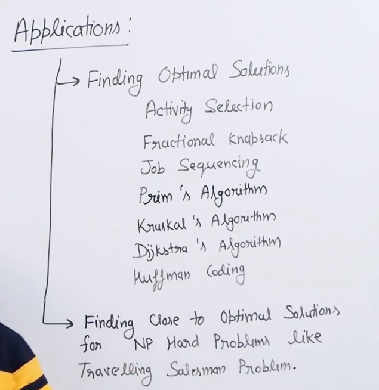

## Greedy Algorithms
Are always used in optimization Problem

Basic structure of greedy algorithm are as follows:

```
getOptimization (Item [] arr, int n)
1.)  Initialize result res
2.) While All Items are not considered
    {
        i= select an item;
        if(item i is feasible)
            res+= i
        else:
            continue
    }
3.) return res
```

Please note that greedy will not work always
example for coin problem for 18, 1,10 and we need to generate 20 with min coins
-> greedy ans is 18+1+1 but actual ans is 10+10



